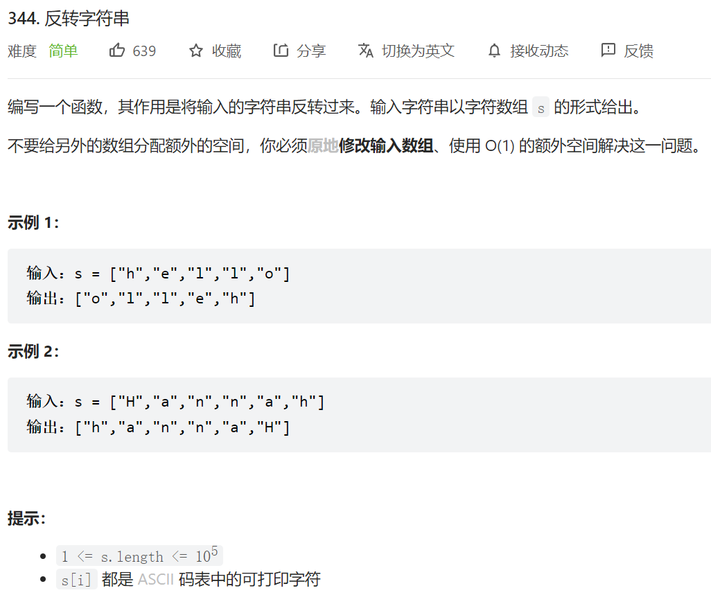
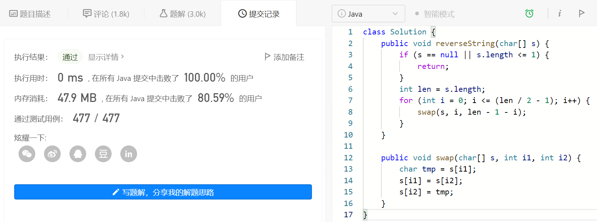

# 【第一遍】反转字符数组

## 题目：

https://leetcode.cn/problems/reverse-string/




## 答题：




```java
class Solution {
    public void reverseString(char[] s) {
        if (s == null || s.length <= 1) {
            return;
        }
        int len = s.length;
        for (int i = 0; i <= (len / 2 - 1); i++) {
            swap(s, i, len - 1 - i);
        }
    }

    public void swap(char[] s, int i1, int i2) {
        char tmp = s[i1];
        s[i1] = s[i2];
        s[i2] = tmp;
    }
}
```

## 思路：

for 循环对称交换即可。

最主要的是计算边界，奇数个元素、偶数个元素时，需要分别到哪里结束。

- 带入特殊值：

> len = 4, 0 1 2 3，此时只需要到 1 即可
>
> len = 5, 0 1 2 3 4，此时只需要到 1 即可
>
> 所以：边界为len/2 - 1

交换的两个元素的下标关系：

> len = 5, 0 1 2 3 4
>
> 0 -> 4, 1 -> 3, ...
>
> 所以 i -> len - 1 - i